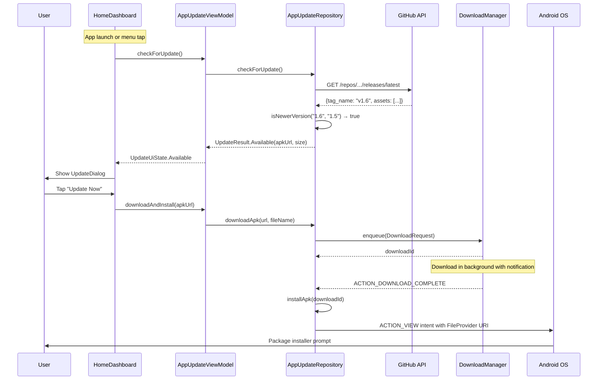

# Implementation Plan: In-App "Check for Updates" Feature

## Requirements Restatement

Build a self-update mechanism that:
1. Checks the GitHub Releases API (`https://api.github.com/repos/akvo/african-bamboo-odk-external-validations/releases/latest`) for new versions
2. Compares the remote `tag_name` against the local `BuildConfig.VERSION_NAME` ("1.5")
3. If a newer version exists, prompts the user with release info
4. Downloads the `.apk` asset and triggers Android's native package installer
5. Checks automatically on app launch + manually via a "Check for Updates" menu item

## Risk Assessment

| Risk | Level | Mitigation |
|------|-------|------------|
| **Android 7+ requires FileProvider for APK install** | HIGH | Must declare FileProvider in Manifest + `file_paths.xml` |
| **Android 8+ requires `REQUEST_INSTALL_PACKAGES` permission** | HIGH | Add to Manifest; handled at install time |
| **Android 12+ restricts background installs** | MEDIUM | Always user-initiated, show notification when download completes |
| **GitHub API rate limit (60 req/hr unauthenticated)** | LOW | Check once per app launch + manual; well within limits |
| **Large APK download on metered connection** | MEDIUM | Warn on metered network; use `DownloadManager` for reliability |
| **Version comparison edge cases** | LOW | Use semantic version parsing (split on `.`, compare numerically) |
| **User on API 24-25 (no `REQUEST_INSTALL_PACKAGES`)** | LOW | Permission only required on API 26+; conditional handling |

## Architecture Decision

Use Android's built-in **`DownloadManager`** instead of OkHttp/Retrofit for the APK download because:
- Handles large file downloads reliably (pause/resume, retry on network loss)
- Shows download progress in the notification tray natively
- No need for a foreground service

Use a **separate OkHttpClient** (no auth interceptors) for the GitHub API call since the existing OkHttp client has KoboToolbox Basic Auth interceptors that would interfere.

## File Impact Summary

```
New Files (7):
├── data/network/GitHubApiService.kt          # Retrofit interface for GitHub API
├── data/dto/GitHubReleaseDto.kt              # Response DTOs
├── data/repository/AppUpdateRepository.kt    # Update check + download logic
├── ui/viewmodel/AppUpdateViewModel.kt        # UI state management
├── ui/component/UpdateDialog.kt              # Compose update dialog
├── di/GitHubModule.kt                        # Hilt module for GitHub networking
└── res/xml/file_paths.xml                    # FileProvider paths config

Modified Files (4):
├── AndroidManifest.xml                       # Permissions + FileProvider
├── app/build.gradle.kts                      # BuildConfig field for VERSION_NAME
├── ui/screen/HomeDashboardScreen.kt          # "Check for Updates" menu item
└── ui/viewmodel/HomeViewModel.kt             # Trigger update check on launch
```

---

## Implementation Phases

### Phase 1: Infrastructure — Permissions, FileProvider, BuildConfig

**1a. AndroidManifest.xml** — Add permissions and FileProvider:

```xml
<!-- New permissions -->
<uses-permission android:name="android.permission.REQUEST_INSTALL_PACKAGES" />
<uses-permission android:name="android.permission.WRITE_EXTERNAL_STORAGE"
    android:maxSdkVersion="28" />

<!-- Inside <application> -->
<provider
    android:name="androidx.core.content.FileProvider"
    android:authorities="${applicationId}.fileprovider"
    android:exported="false"
    android:grantUriPermissions="true">
    <meta-data
        android:name="android.support.FILE_PROVIDER_PATHS"
        android:resource="@xml/file_paths" />
</provider>
```

**1b. `res/xml/file_paths.xml`** — FileProvider path config:

```xml
<paths>
    <external-path name="downloads" path="Download/" />
</paths>
```

**1c. `app/build.gradle.kts`** — Expose GitHub repo to code:

```kotlin
buildTypes {
    // In each build type (or defaultConfig):
    buildConfigField("String", "GITHUB_REPO", "\"akvo/african-bamboo-odk-external-validations\"")
}
```

> Note: `BuildConfig.VERSION_NAME` is already available from `versionName = "1.5"`.

---

### Phase 2: Data Layer — GitHub API + DTOs + Repository

**2a. `data/dto/GitHubReleaseDto.kt`** — Response models:

```kotlin
@Serializable
data class GitHubReleaseDto(
    @SerialName("tag_name") val tagName: String,
    val name: String? = null,
    val body: String? = null,
    @SerialName("html_url") val htmlUrl: String,
    val assets: List<GitHubAssetDto> = emptyList()
)

@Serializable
data class GitHubAssetDto(
    val name: String,
    @SerialName("browser_download_url") val browserDownloadUrl: String,
    val size: Long = 0
)
```

**2b. `data/network/GitHubApiService.kt`** — Retrofit interface:

```kotlin
interface GitHubApiService {
    @GET("repos/{owner}/{repo}/releases/latest")
    suspend fun getLatestRelease(
        @Path("owner") owner: String,
        @Path("repo") repo: String
    ): GitHubReleaseDto
}
```

**2c. `di/GitHubModule.kt`** — Separate Hilt module (no auth interceptors):

```kotlin
@Module
@InstallIn(SingletonComponent::class)
object GitHubModule {

    @Provides @Singleton @Named("github")
    fun provideGitHubOkHttpClient(): OkHttpClient { /* no auth interceptors */ }

    @Provides @Singleton @Named("github")
    fun provideGitHubRetrofit(@Named("github") client: OkHttpClient, json: Json): Retrofit { /* base: api.github.com */ }

    @Provides @Singleton
    fun provideGitHubApiService(@Named("github") retrofit: Retrofit): GitHubApiService
}
```

**2d. `data/repository/AppUpdateRepository.kt`** — Core logic:

```kotlin
@Singleton
class AppUpdateRepository @Inject constructor(
    private val gitHubApiService: GitHubApiService,
    @ApplicationContext private val context: Context
) {
    suspend fun checkForUpdate(): UpdateResult { /* compare versions */ }
    fun downloadApk(url: String, fileName: String): Long { /* DownloadManager */ }
    fun installApk(downloadId: Long) { /* FileProvider + ACTION_VIEW intent */ }
}

sealed class UpdateResult {
    data class Available(val release: GitHubReleaseDto, val apkUrl: String, val apkSize: Long) : UpdateResult()
    object UpToDate : UpdateResult()
    data class Error(val message: String) : UpdateResult()
}
```

**Version comparison logic:**

```kotlin
fun isNewerVersion(remote: String, current: String): Boolean {
    val r = remote.removePrefix("v").split(".").map { it.toIntOrNull() ?: 0 }
    val c = current.removePrefix("v").split(".").map { it.toIntOrNull() ?: 0 }
    for (i in 0 until maxOf(r.size, c.size)) {
        val rv = r.getOrElse(i) { 0 }
        val cv = c.getOrElse(i) { 0 }
        if (rv > cv) return true
        if (rv < cv) return false
    }
    return false
}
```

---

### Phase 3: UI Layer — ViewModel, Dialog, Menu Integration

**3a. `ui/viewmodel/AppUpdateViewModel.kt`** — Manages update state:

```kotlin
@HiltViewModel
class AppUpdateViewModel @Inject constructor(
    private val appUpdateRepository: AppUpdateRepository
) : ViewModel() {

    private val _updateState = MutableStateFlow<UpdateUiState>(UpdateUiState.Idle)
    val updateState: StateFlow<UpdateUiState> = _updateState.asStateFlow()

    fun checkForUpdate() { /* viewModelScope.launch */ }
    fun downloadAndInstall(apkUrl: String) { /* triggers DownloadManager */ }
    fun dismissUpdate() { _updateState.value = UpdateUiState.Idle }
}

sealed class UpdateUiState {
    object Idle : UpdateUiState()
    object Checking : UpdateUiState()
    data class Available(
        val version: String,
        val releaseNotes: String?,
        val apkUrl: String,
        val apkSizeMb: String
    ) : UpdateUiState()
    object Downloading : UpdateUiState()
    object UpToDate : UpdateUiState()
    data class Error(val message: String) : UpdateUiState()
}
```

**3b. `ui/component/UpdateDialog.kt`** — Compose dialog:

```
┌─────────────────────────────────┐
│  Update Available               │
│                                 │
│  Version 1.6 is available       │
│  (Current: 1.5)                 │
│                                 │
│  What's new:                    │
│  • Bug fixes                    │
│  • New validation rules         │
│                                 │
│  Download size: 12.3 MB         │
│                                 │
│  [Later]            [Update Now]│
└─────────────────────────────────┘
```

**3c. Integrate into `HomeDashboardScreen.kt`:**
- Add "Check for Updates" item to the existing `DropdownMenu` (alongside "Offline Maps" and "Logout")
- Auto-check on first composition via `LaunchedEffect`
- Show `UpdateDialog` when state is `Available`

**3d. Integrate into `HomeViewModel.kt`:**
- Inject `AppUpdateRepository`, trigger check on init
- Or: share `AppUpdateViewModel` at the activity level and observe from `HomeDashboardScreen`

---

### Phase 4: Download Completion Handling

Register a `BroadcastReceiver` for `DownloadManager.ACTION_DOWNLOAD_COMPLETE`:

```kotlin
// In AppUpdateRepository or a dedicated receiver
class DownloadCompleteReceiver : BroadcastReceiver() {
    override fun onReceive(context: Context, intent: Intent) {
        val downloadId = intent.getLongExtra(DownloadManager.EXTRA_DOWNLOAD_ID, -1)
        // Verify download succeeded, then trigger installApk()
    }
}
```

Register dynamically in `AppUpdateViewModel` when download starts, unregister when done.

---

### Phase 5: UX Polish & Edge Cases

| Scenario | Behavior |
|----------|----------|
| No internet | Skip check silently on auto; show error on manual |
| Metered network | Show file size prominently; let user decide |
| Download fails | Show retry option in Snackbar |
| User denies install permission | Show dialog explaining why it's needed |
| APK asset not found in release | Show "Visit GitHub" fallback link |
| Already latest version (manual check) | Show Snackbar: "You're up to date (v1.5)" |
| App backgrounded during download | DownloadManager continues; notification shows progress |

---

## Sequence Diagram



---

## Estimated Complexity: MEDIUM

- Data layer (API + Repository): ~3 files, ~200 lines
- DI module: ~1 file, ~50 lines
- ViewModel + UI: ~2 files, ~200 lines
- Manifest/config: ~3 small changes
- **Total new code: ~500 lines across 7 new files + 4 modifications**

---

## Implementation Order (Recommended)

1. **Phase 1** (Infrastructure) — can be done in one commit
2. **Phase 2** (Data layer) — testable independently with unit tests
3. **Phase 3** (UI) — visible result, can demo
4. **Phase 4** (Download receiver) — completes the flow
5. **Phase 5** (Polish) — edge case handling
