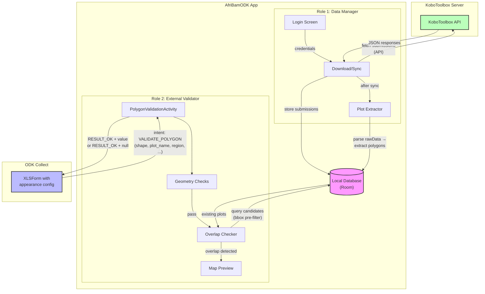
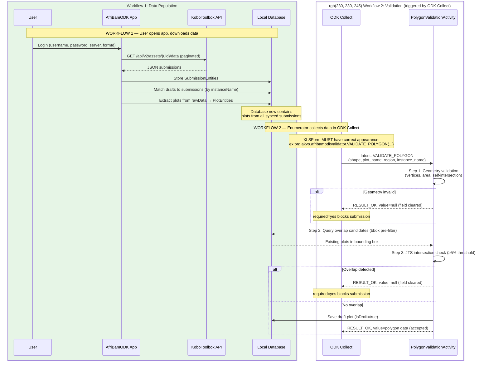
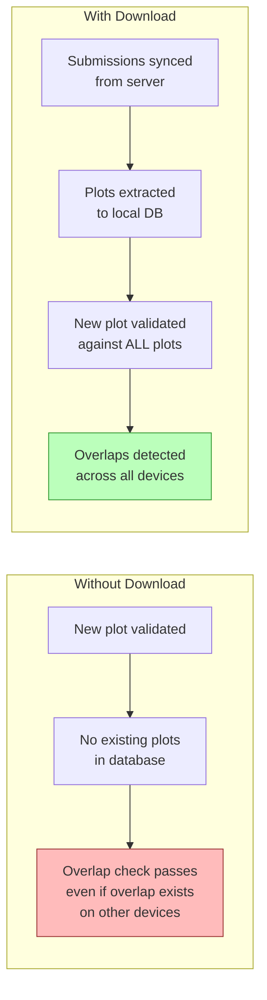
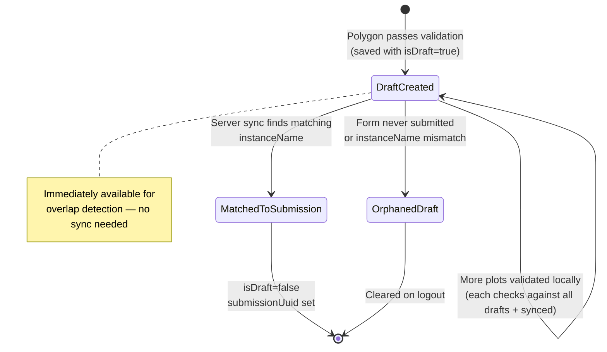
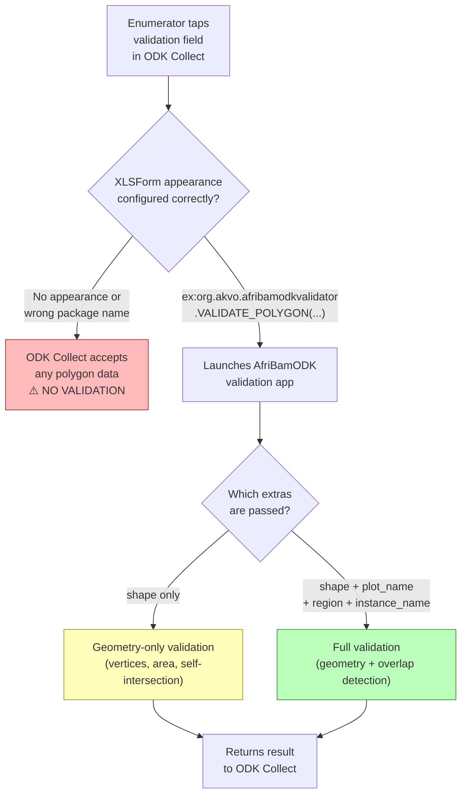

# Architecture Overview

## Common Misconception

> "I logged in and downloaded data, so the app will automatically validate my polygons."

**This is incorrect.** The AfriBamODK app has two **independent** roles that work together but are triggered differently:

| Role | Triggered by | Purpose |
|------|-------------|---------|
| **Data Manager** | User opens the app, logs in | Downloads submissions from KoboToolbox and extracts plots into the local database |
| **External Validator** | ODK Collect launches the app via intent | Validates polygon geometry and checks for overlaps against the local database |

The download populates the database. The validation **only happens when ODK Collect calls the app** through a correctly configured XLSForm.

---

## System Overview

---

## Two Independent Workflows

The following sequence diagram shows the two workflows and how the local database is the bridge between them.

---

## Why Both Workflows Are Needed

**The download is not for validation itself** — it is for **populating the local plot database** so that overlap detection has comprehensive data to compare against. Without downloading, the app can only detect overlaps between plots collected on the **same device** during the **current session**.

---

## Draft Plot Lifecycle

Draft plots bridge the gap between local validation and server sync.

---

## What the XLSForm Controls

The XLSForm `appearance` column determines whether validation runs at all and what type of validation is performed:

