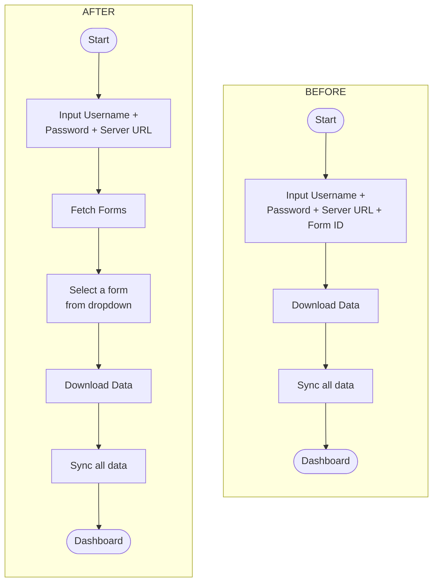

# Asset Dropdown Login Refactor

Replace the Form ID text input on the LoginScreen with a dropdown populated from the Kobo assets list API.

## Workflow Change



## Two-Phase Login Screen

The LoginScreen becomes a two-phase UI on a single screen:

- **Phase 1**: Enter credentials (username, password, server URL) -> tap "Fetch Forms"
- **Phase 2**: Select a form from the dropdown -> tap "Download Data"

## API Endpoint

```
GET {{baseUrl}}/api/v2/assets/
Authorization: Basic {base64(username:password)}
```

Response fields used: `uid` (value), `name` (label) from each item in `results`.

## Files Changed

### 1. New DTO: `KoboAssetDto.kt`

```kotlin
// data/dto/KoboAssetDto.kt
package org.akvo.afribamodkvalidator.data.dto

import kotlinx.serialization.SerialName
import kotlinx.serialization.Serializable

@Serializable
data class KoboAsset(
    @SerialName("uid")
    val uid: String,
    @SerialName("name")
    val name: String
)

@Serializable
data class KoboAssetsResponse(
    @SerialName("count")
    val count: Int,
    @SerialName("next")
    val next: String? = null,
    @SerialName("results")
    val results: List<KoboAsset>
)
```

### 2. Updated `KoboApiService.kt`

Add the assets list endpoint:

```kotlin
@GET("api/v2/assets/")
suspend fun getAssets(
    @Query("limit") limit: Int = 100
): KoboAssetsResponse
```

### 3. Updated `LoginUiState`

```kotlin
data class LoginUiState(
    val username: String = "",
    val password: String = "",
    val serverUrl: String = "https://kc-eu.kobotoolbox.org",
    // Phase 2 state
    val assets: List<KoboAsset> = emptyList(),
    val selectedAsset: KoboAsset? = null,
    val isLoadingAssets: Boolean = false,
    val assetsError: String? = null
) {
    /** Phase 1: credentials are filled */
    val areCredentialsValid: Boolean
        get() = username.isNotBlank() &&
                password.isNotBlank() &&
                serverUrl.isNotBlank()

    /** Phase 2: a form has been selected */
    val isFormValid: Boolean
        get() = areCredentialsValid && selectedAsset != null

    /** Whether we've fetched assets (entered phase 2) */
    val hasAssets: Boolean
        get() = assets.isNotEmpty()
}
```

### 4. Updated `LoginViewModel`

```kotlin
@HiltViewModel
class LoginViewModel @Inject constructor(
    private val authCredentials: AuthCredentials,
    private val apiService: KoboApiService
) : ViewModel() {

    private val _uiState = MutableStateFlow(LoginUiState())
    val uiState: StateFlow<LoginUiState> = _uiState.asStateFlow()

    // ... existing onXxxChange methods ...

    /** Phase 1 -> Phase 2: set credentials temporarily and fetch assets */
    fun fetchAssets() {
        val state = _uiState.value
        // Set credentials so interceptors can authenticate the request
        authCredentials.set(
            username = state.username.trim(),
            password = state.password,
            assetUid = "",  // not known yet
            serverUrl = state.serverUrl.trim()
        )

        _uiState.update { it.copy(isLoadingAssets = true, assetsError = null) }

        viewModelScope.launch {
            try {
                val response = apiService.getAssets()
                _uiState.update {
                    it.copy(
                        assets = response.results,
                        isLoadingAssets = false
                    )
                }
            } catch (e: Exception) {
                _uiState.update {
                    it.copy(
                        isLoadingAssets = false,
                        assetsError = e.message ?: "Failed to fetch forms"
                    )
                }
            }
        }
    }

    fun onAssetSelected(asset: KoboAsset) {
        _uiState.update { it.copy(selectedAsset = asset) }
    }

    /** Phase 2 -> Download: finalize credentials with selected asset */
    fun startLoginAndDownloadProcess() {
        val state = _uiState.value
        val asset = state.selectedAsset ?: return
        authCredentials.set(
            username = state.username.trim(),
            password = state.password,
            assetUid = asset.uid,
            serverUrl = state.serverUrl.trim()
        )
    }
}
```

### 5. Updated `LoginScreen.kt`

Replace the Form ID `OutlinedTextField` with an `ExposedDropdownMenuBox`:

```kotlin
@Composable
private fun LoginScreenContent(
    uiState: LoginUiState,
    onUsernameChange: (String) -> Unit,
    onPasswordChange: (String) -> Unit,
    onServerUrlChange: (String) -> Unit,
    onFetchAssetsClick: () -> Unit,
    onAssetSelected: (KoboAsset) -> Unit,
    onDownloadClick: () -> Unit,
    modifier: Modifier = Modifier
) {
    // ... username, password, serverUrl fields (unchanged) ...

    // Phase 2: Asset dropdown (shown after fetch)
    if (uiState.hasAssets) {
        AssetDropdown(
            assets = uiState.assets,
            selectedAsset = uiState.selectedAsset,
            onAssetSelected = onAssetSelected
        )
    }

    // Error message
    if (uiState.assetsError != null) {
        Text(
            text = uiState.assetsError,
            color = MaterialTheme.colorScheme.error
        )
    }

    // Phase 1 button: "Fetch Forms" (before assets loaded)
    // Phase 2 button: "Download Data" (after asset selected)
    if (!uiState.hasAssets) {
        Button(
            onClick = onFetchAssetsClick,
            enabled = uiState.areCredentialsValid && !uiState.isLoadingAssets
        ) {
            if (uiState.isLoadingAssets) {
                CircularProgressIndicator(modifier = Modifier.size(20.dp))
                Spacer(modifier = Modifier.width(8.dp))
            }
            Text(if (uiState.isLoadingAssets) "Fetching Forms..." else "Fetch Forms")
        }
    } else {
        Button(
            onClick = onDownloadClick,
            enabled = uiState.isFormValid
        ) {
            Text("Download Data")
        }
    }
}

@OptIn(ExperimentalMaterial3Api::class)
@Composable
private fun AssetDropdown(
    assets: List<KoboAsset>,
    selectedAsset: KoboAsset?,
    onAssetSelected: (KoboAsset) -> Unit
) {
    var expanded by remember { mutableStateOf(false) }

    ExposedDropdownMenuBox(
        expanded = expanded,
        onExpandedChange = { expanded = it }
    ) {
        OutlinedTextField(
            value = selectedAsset?.name ?: "",
            onValueChange = {},
            readOnly = true,
            label = { Text("Select Form") },
            trailingIcon = { ExposedDropdownMenuDefaults.TrailingIcon(expanded) },
            modifier = Modifier
                .fillMaxWidth()
                .menuAnchor(MenuAnchorType.PrimaryNotEditable)
        )
        ExposedDropdownMenu(
            expanded = expanded,
            onDismissRequest = { expanded = false }
        ) {
            assets.forEach { asset ->
                DropdownMenuItem(
                    text = { Text(asset.name) },
                    onClick = {
                        onAssetSelected(asset)
                        expanded = false
                    }
                )
            }
        }
    }
}
```

### 6. Credential fields become read-only in Phase 2

Once assets are fetched, disable the username/password/serverUrl fields to prevent editing credentials while a dropdown is showing stale results. Changing credentials requires going back to phase 1 (e.g., via a "Change Account" link or clearing assets).
