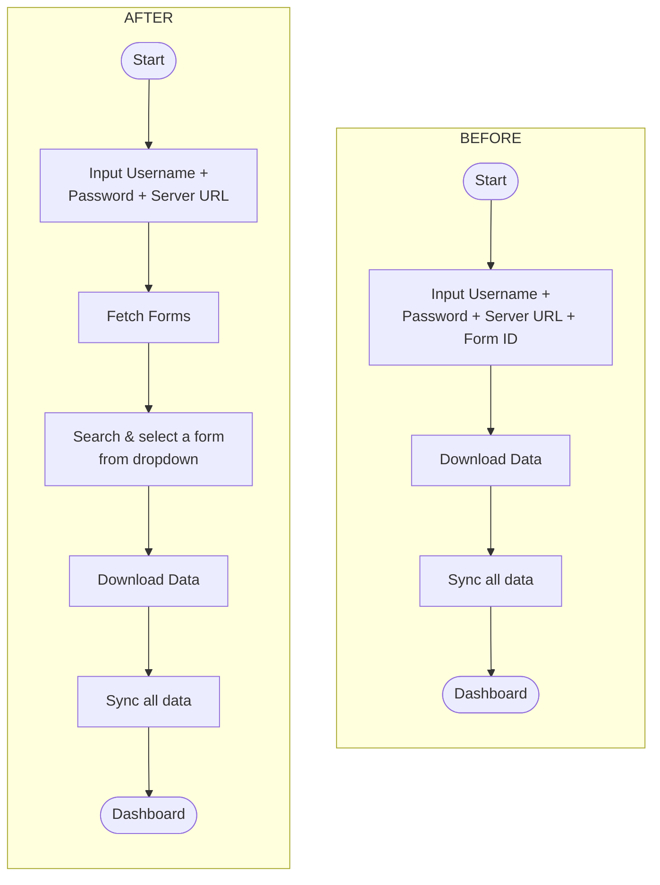

# Asset Dropdown Login Refactor

Replace the Form ID text input on the LoginScreen with a searchable dropdown populated from the Kobo assets list API.

## Workflow Change



## Two-Phase Login Screen

The LoginScreen becomes a two-phase UI on a single screen:

- **Phase 1**: Enter credentials (username, password, server URL) -> tap "Fetch Forms"
  - Credential fields are disabled while the fetch is in-flight
- **Phase 2**: Search and select a form from the dropdown -> tap "Download Data"
  - Credential fields remain disabled after assets are fetched
  - Draft forms (`deployment_status = "draft"`) are excluded from the dropdown

## API Endpoint

```
GET {{baseUrl}}/api/v2/assets/?limit=300&start=0
Authorization: Basic {base64(username:password)}
```

Paginated using `do/while (response.next != null)` loop, consistent with submission endpoints.

Response fields used: `uid` (value + subtitle), `name` (label), `deployment_status` (filtering).

## Files Changed

### 1. New DTO: `KoboAssetDto.kt`

```kotlin
package org.akvo.afribamodkvalidator.data.dto

@Serializable
data class KoboAsset(
    @SerialName("uid")
    val uid: String,
    @SerialName("name")
    val name: String,
    @SerialName("deployment_status")
    val deploymentStatus: String? = null
)

@Serializable
data class KoboAssetsResponse(
    @SerialName("count")
    val count: Int,
    @SerialName("next")
    val next: String? = null,
    @SerialName("results")
    val results: List<KoboAsset>
)
```

### 2. Updated `KoboApiService.kt`

Added the assets list endpoint with pagination params:

```kotlin
@GET("api/v2/assets/")
suspend fun getAssets(
    @Query("limit") limit: Int = DEFAULT_PAGE_SIZE,
    @Query("start") start: Int = 0
): KoboAssetsResponse
```

### 3. Updated `AuthCredentials.kt`

Added `setTemporary()` for in-memory-only credentials (no session persistence). This allows the interceptors to authenticate the assets fetch without marking the user as logged in or overwriting a previously saved `assetUid`:

```kotlin
fun setTemporary(username: String, password: String, serverUrl: String) {
    this.username = username
    this.password = password
    this.serverUrl = normalizeServerUrl(serverUrl)
}
```

Session is only persisted via `set()` in `startLoginAndDownloadProcess()` when the user has selected a form.

### 4. Updated `LoginUiState`

```kotlin
data class LoginUiState(
    val username: String = "",
    val password: String = "",
    val serverUrl: String = "https://kc-eu.kobotoolbox.org",
    val assets: List<KoboAsset> = emptyList(),
    val selectedAsset: KoboAsset? = null,
    val isLoadingAssets: Boolean = false,
    val assetsError: String? = null
) {
    val areCredentialsValid: Boolean
        get() = username.isNotBlank() &&
                password.isNotBlank() &&
                serverUrl.isNotBlank()

    val isFormValid: Boolean
        get() = areCredentialsValid && selectedAsset != null

    val hasAssets: Boolean
        get() = assets.isNotEmpty()
}
```

### 5. Updated `LoginViewModel`

```kotlin
@HiltViewModel
class LoginViewModel @Inject constructor(
    private val authCredentials: AuthCredentials,
    private val apiService: KoboApiService
) : ViewModel() {

    // ... existing onXxxChange methods ...

    /** Phase 1 -> Phase 2: set credentials temporarily (no session persist) and fetch assets */
    fun fetchAssets() {
        val state = _uiState.value
        authCredentials.setTemporary(
            username = state.username.trim(),
            password = state.password,
            serverUrl = state.serverUrl.trim()
        )

        _uiState.update { it.copy(isLoadingAssets = true, assetsError = null) }

        viewModelScope.launch {
            try {
                val allAssets = mutableListOf<KoboAsset>()
                var start = 0
                val pageSize = KoboApiService.DEFAULT_PAGE_SIZE

                do {
                    val response = apiService.getAssets(limit = pageSize, start = start)
                    allAssets.addAll(response.results.filter { it.deploymentStatus != "draft" })
                    start += pageSize
                } while (response.next != null)

                _uiState.update {
                    it.copy(assets = allAssets, isLoadingAssets = false)
                }
            } catch (e: CancellationException) {
                throw e
            } catch (e: Exception) {
                _uiState.update {
                    it.copy(
                        isLoadingAssets = false,
                        assetsError = e.message ?: "Failed to fetch forms"
                    )
                }
            }
        }
    }

    fun onAssetSelected(asset: KoboAsset) {
        _uiState.update { it.copy(selectedAsset = asset) }
    }

    /** Phase 2 -> Download: finalize credentials with selected asset (persists session) */
    fun startLoginAndDownloadProcess() {
        val state = _uiState.value
        val asset = state.selectedAsset ?: return
        authCredentials.set(
            username = state.username.trim(),
            password = state.password,
            assetUid = asset.uid,
            serverUrl = state.serverUrl.trim()
        )
    }
}
```

### 6. Updated `LoginScreen.kt`

Key UI behaviors:

- **Credential fields** disabled when `hasAssets || isLoadingAssets`
- **Phase 1 button**: "Fetch Forms" with `CircularProgressIndicator` during loading
- **Phase 2 button**: "Download Data" enabled when `isFormValid`
- **Searchable dropdown**: editable text field filters assets by name when expanded, shows `selectedAsset.name` when collapsed
- **Dropdown items**: form name as title, `uid` as subtitle in `bodySmall` style
- **Empty state**: "No forms found" shown when search query matches nothing

```kotlin
@OptIn(ExperimentalMaterial3Api::class)
@Composable
private fun AssetDropdown(
    assets: List<KoboAsset>,
    selectedAsset: KoboAsset?,
    onAssetSelected: (KoboAsset) -> Unit
) {
    var expanded by remember { mutableStateOf(false) }
    var searchQuery by remember { mutableStateOf("") }

    val filteredAssets = remember(assets, searchQuery) {
        if (searchQuery.isBlank()) assets
        else assets.filter { it.name.contains(searchQuery, ignoreCase = true) }
    }

    ExposedDropdownMenuBox(
        expanded = expanded,
        onExpandedChange = { expanded = it }
    ) {
        OutlinedTextField(
            value = if (expanded) searchQuery else (selectedAsset?.name ?: ""),
            onValueChange = { searchQuery = it },
            label = { Text("Select Form") },
            placeholder = if (expanded) {{ Text("Search forms...") }} else null,
            trailingIcon = { ExposedDropdownMenuDefaults.TrailingIcon(expanded) },
            singleLine = true,
            modifier = Modifier
                .fillMaxWidth()
                .menuAnchor(MenuAnchorType.PrimaryEditable)
        )
        ExposedDropdownMenu(
            expanded = expanded,
            onDismissRequest = {
                expanded = false
                searchQuery = ""
            }
        ) {
            if (filteredAssets.isEmpty()) {
                DropdownMenuItem(
                    text = { Text("No forms found", color = MaterialTheme.colorScheme.onSurfaceVariant) },
                    onClick = {},
                    enabled = false
                )
            } else {
                filteredAssets.forEach { asset ->
                    DropdownMenuItem(
                        text = {
                            Column {
                                Text(asset.name)
                                Text(
                                    text = asset.uid,
                                    style = MaterialTheme.typography.bodySmall,
                                    color = MaterialTheme.colorScheme.onSurfaceVariant
                                )
                            }
                        },
                        onClick = {
                            onAssetSelected(asset)
                            expanded = false
                            searchQuery = ""
                        }
                    )
                }
            }
        }
    }
}
```
