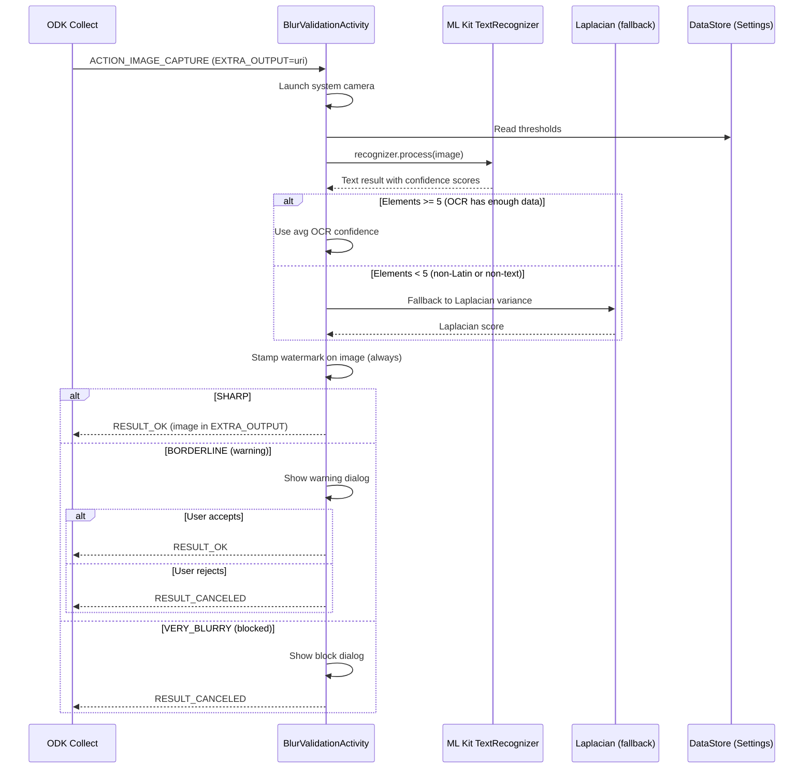

# Implementation Plan: Image Quality Validation for Text Documents

## Requirements

**Goal**: Add blur detection for document photos (title deeds, farmer names) captured via ODK Collect. At collection time, warn or block enumerators when the image is too blurry for text to be readable. **All validated images get a quality watermark overlay** so supervisors can identify borderline photos that were accepted.

**Key constraints**:
- **Two-tier approach**: block very blurry (unreadable), warn borderline cases
- Must detect both **focus blur** AND **motion blur** (phone shake)
- **Watermark on ALL validated images** — supervisors see quality at a glance
- Must work **offline** on-device — no server dependency
- Thresholds adjustable via **in-app Settings screen** with reset to defaults
- Works as a **custom camera app** for ODK Collect (`app=` parameter)
- Target: photos where text (farmer names, title deed pages) is unreadable

## Benchmark Results (Real Device Testing)

Tested on Samsung SM-A145F with 6 fixture photos. Results prove Laplacian alone fails on motion blur and ML Kit OCR is needed.

### Side-by-Side: OCR vs Laplacian

| # | Photo | OCR Conf | Elements | Laplacian | Expected | OCR Correct? | Laplacian Correct? |
|---|-------|----------|----------|-----------|----------|:---:|:---:|
| 1 | Title deed (Amharic) | 0.423 | 1 | 1786.8 | SHARP | Fallback* | Yes |
| 2 | Keyboard focus blur | 0.000 | 0 | 26.2 | BLURRY | Yes | Yes |
| 3 | **Screen motion blur** | **0.489** | **22** | **1921.2** | **BLURRY** | **Yes** | **No** |
| 4 | Keyboard clear | 0.691 | 17 | 287.0 | SHARP | Yes | Yes |
| 5 | Keyboard extreme motion | 0.000 | 0 | 44.0 | VERY_BLURRY | Yes | Yes |
| 6 | Book page (Indonesian) | 0.816 | 220 | 3097.0 | SHARP | Yes | Yes |

**\*Amharic text**: ML Kit Latin recognizer only finds 1 element (`J0103163`) — falls back to Laplacian which correctly identifies it as sharp (1786.8).

### Key Findings

1. **Laplacian fails on motion blur**: Photo #3 scores 1921.2 (higher than sharp keyboard 287.0!) because motion streaks register as edges.
2. **OCR catches motion blur**: Photo #3 OCR confidence = 0.489 with garbled text `"Rto libs erstons, oml?"` — correctly flagged as borderline.
3. **OCR fails on non-Latin text**: Photo #1 (Amharic) gets only 1 element — must fall back to Laplacian.
4. **Element count is the trigger**: When `elements >= 5`, OCR confidence is reliable. When `elements < 5`, fall back to Laplacian.

### Accuracy Comparison

| Method | Accuracy | Failure Case |
|--------|----------|-------------|
| Laplacian alone | 5/6 (83%) | Motion blur scored as SHARP |
| OCR alone | 5/6 (83%) | Non-Latin text scored as BLURRY |
| **Hybrid (OCR + Laplacian fallback)** | **6/6 (100%)** | None |

## Design Decisions

| Decision | Choice | Rationale |
|----------|--------|-----------|
| Primary metric | ML Kit OCR confidence | Directly measures text readability; catches motion blur |
| Fallback metric | Laplacian variance | Handles non-Latin text and non-text images |
| Fallback trigger | `elementCount < 5` | Benchmark shows OCR unreliable with few elements |
| Image input | Camera capture via `ACTION_IMAGE_CAPTURE` | ODK's `app=` parameter; cleanest integration |
| ODK integration | Custom camera app | Capture + validate in one step |
| Config storage | Jetpack DataStore | Runtime-editable via Settings screen |
| Image return | Copy to ODK's `EXTRA_OUTPUT` URI | Standard camera app contract |
| **Watermark** | **On ALL validated images (sharp, borderline, blocked)** | Supervisor audit trail |
| Gallery | Blocked via `appearance: new` in XLSForm | Title deeds should be fresh photos |

## Architecture



## XLSForm Configuration

| type | name | label | hint | parameters | appearance | required |
|------|------|-------|------|------------|------------|----------|
| image | title_deed_page1 | Title Deed - Page 1 | Take a clear photo of the first page | max-pixels=1024 app=org.akvo.afribamodkvalidator | | yes |
| image | title_deed_page2 | Title Deed - Page 2 | Take a clear photo of the second page | max-pixels=1024 app=org.akvo.afribamodkvalidator | | yes |

- `app=org.akvo.afribamodkvalidator` — launches our app as the camera
- `max-pixels=1024` — ODK downscales after receiving the image
- **Do NOT use `appearance: new`** — it conflicts with `app=` and reverts to default camera ([ODK forum reference](https://forum.getodk.org/t/using-external-camera-app-issue-with-using-appearance-field/50292/2)). Gallery picks bypass blur validation but are typically not motion-blurred

## Implementation Phases

### Phase 1: Dependencies & BlurDetector Core

**Files to create/modify**:
- `gradle/libs.versions.toml` — MODIFY (add ML Kit, DataStore, coroutines-play-services)
- `app/build.gradle.kts` — MODIFY (add dependencies)
- `validation/BlurDetector.kt` — CREATE (hybrid OCR + Laplacian)

**Dependencies**:
```kotlin
// Already added in libs.versions.toml
mlkitTextRecognition = "16.0.1"
datastorePreferences = "1.1.1"
coroutinesPlayServices = "1.8.1"
```

**BlurDetector — hybrid algorithm**:
```kotlin
class BlurDetector(private val context: Context) {

    data class BlurResult(
        val score: Double,           // 0.0-1.0 for OCR, or normalized Laplacian
        val level: BlurLevel,
        val method: String,          // "ocr" or "laplacian"
        val ocrConfidence: Double,
        val textBlockCount: Int,
        val elementCount: Int,
        val laplacianVariance: Double,
        val detectedText: String     // first 100 chars of OCR output
    )

    suspend fun detect(
        bitmap: Bitmap,
        ocrWarnThreshold: Double = DEFAULT_OCR_WARN,
        ocrBlockThreshold: Double = DEFAULT_OCR_BLOCK,
        lapWarnThreshold: Double = DEFAULT_LAP_WARN,
        lapBlockThreshold: Double = DEFAULT_LAP_BLOCK
    ): BlurResult {
        // 1. Run ML Kit OCR
        val ocrResult = runOcrAnalysis(bitmap)

        // 2. Decide method based on element count
        return if (ocrResult.elementCount >= MIN_ELEMENTS_FOR_OCR) {
            classifyByOcr(ocrResult, ocrWarnThreshold, ocrBlockThreshold)
        } else {
            // Fallback: Laplacian (non-Latin text or non-text image)
            classifyByLaplacian(bitmap, ocrResult, lapWarnThreshold, lapBlockThreshold)
        }
    }

    companion object {
        const val DEFAULT_OCR_WARN = 0.65
        const val DEFAULT_OCR_BLOCK = 0.35
        const val DEFAULT_LAP_WARN = 100.0
        const val DEFAULT_LAP_BLOCK = 50.0
        const val MIN_ELEMENTS_FOR_OCR = 5
    }
}
```

### Phase 2: BlurValidationActivity (Custom Camera App)

**Files to create/modify**:
- `validation/BlurValidationActivity.kt` — CREATE
- `validation/ImageWatermark.kt` — CREATE
- `AndroidManifest.xml` — MODIFY (register activity + FileProvider)
- `res/xml/file_paths.xml` — CREATE

**Activity flow**:
1. ODK launches via `ACTION_IMAGE_CAPTURE` with `EXTRA_OUTPUT` URI
2. Activity launches system camera via `TakePicture()` contract
3. On capture: run `BlurDetector.detect(bitmap)`
4. **Always stamp watermark** (before any dialog)
5. Route based on result level:
   - SHARP → copy watermarked image to ODK URI, `RESULT_OK`
   - BORDERLINE → show warning dialog (Use Anyway / Reject)
   - VERY_BLURRY → show block dialog, `RESULT_CANCELED`

**Watermark design** (on ALL images):

```
┌──────────────────────────────────────────────────┐
│                                                  │
│              (photo content)                     │
│                                                  │
│                                                  │
│                                                  │
│                          ┌─────────────────────┐ │
│                          │ Q:0.82 OCR E:23     │ │
│                          │ [SHARP] ✓           │ │
│                          └─────────────────────┘ │
└──────────────────────────────────────────────────┘
```

**Watermark content by level**:

| Level | Color | Example |
|-------|-------|---------|
| SHARP | Green bg | `Q:0.82 OCR E:23 [SHARP] ✓` |
| BORDERLINE | Yellow bg | `Q:0.52 OCR E:8 [WARNING] ⚠` |
| VERY_BLURRY | Red bg | `Q:0.15 OCR E:2 [BLOCKED] ✗` |
| SHARP (Laplacian) | Green bg | `Q:1786 LAP [SHARP] ✓` |
| BORDERLINE (Laplacian) | Yellow bg | `Q:75 LAP [WARNING] ⚠` |
| VERY_BLURRY (Laplacian) | Red bg | `Q:26 LAP [BLOCKED] ✗` |

- **Q** = quality score (OCR confidence or Laplacian variance)
- **OCR/LAP** = method used
- **E** = element count (OCR only)
- Watermark is always at bottom-right, semi-transparent background
- Text size scales to 3.5% of image width

**Why watermark ALL images**: Supervisors reviewing submitted photos can immediately see:
- Which images were borderline but accepted by the enumerator (yellow `[WARNING] ⚠`)
- The quality score and method used
- Whether the enumerator should be coached to retake such photos

**Manifest registration**:
```xml
<activity
    android:name=".validation.BlurValidationActivity"
    android:exported="true"
    android:theme="@style/Theme.AfriBamODKValidator.AppCompat">
    <intent-filter>
        <action android:name="android.media.action.IMAGE_CAPTURE" />
        <category android:name="android.intent.category.DEFAULT" />
    </intent-filter>
</activity>

<provider
    android:name="androidx.core.content.FileProvider"
    android:authorities="${applicationId}.fileprovider"
    android:exported="false"
    android:grantUriPermissions="true">
    <meta-data
        android:name="android.support.FILE_PROVIDER_PATHS"
        android:resource="@xml/file_paths" />
</provider>
```

### Phase 3: Settings Screen & DataStore

**Files to create/modify**:
- `data/settings/ValidationSettingsDataStore.kt` — CREATE
- `ui/screen/SettingsScreen.kt` — CREATE (Jetpack Compose)
- `ui/viewmodel/SettingsViewModel.kt` — CREATE
- `navigation/Routes.kt` — MODIFY (add Settings route)
- `navigation/AppNavHost.kt` — MODIFY (add Settings composable)
- `ui/screen/HomeDashboardScreen.kt` — MODIFY (add Settings menu item)

**DataStore model**:
```kotlin
data class ValidationSettings(
    val ocrWarnThreshold: Double = 0.65,
    val ocrBlockThreshold: Double = 0.35,
    val laplacianWarnThreshold: Double = 100.0,
    val laplacianBlockThreshold: Double = 50.0,
    val overlapThreshold: Double = 20.0
)
```

**Settings screen** — accessible from Home dashboard MoreVert menu:

```
┌──────────────────────────────────────┐
│ ← Settings                           │
├──────────────────────────────────────┤
│                                      │
│ Image Quality Check (OCR)            │
│ ┌──────────────────────────────────┐ │
│ │ Warn Threshold                   │ │
│ │  [-] ────────●──────────── [+]   │ │
│ │              0.65                │ │
│ │ Warn if OCR confidence below     │ │
│ │ this value (step: 0.05)          │ │
│ ├──────────────────────────────────┤ │
│ │ Block Threshold                  │ │
│ │  [-] ───●──────────────── [+]   │ │
│ │         0.35                     │ │
│ │ Always block if OCR confidence   │ │
│ │ below this value (step: 0.05)    │ │
│ └──────────────────────────────────┘ │
│                                      │
│ Image Quality Check (Laplacian)      │
│ ┌──────────────────────────────────┐ │
│ │ Warn Threshold                   │ │
│ │  [-] ────────●──────────── [+]   │ │
│ │              100                 │ │
│ │ Fallback for non-Latin text      │ │
│ │ (step: 10)                       │ │
│ ├──────────────────────────────────┤ │
│ │ Block Threshold                  │ │
│ │  [-] ───●──────────────── [+]   │ │
│ │         50                       │ │
│ │ (step: 10)                       │ │
│ └──────────────────────────────────┘ │
│                                      │
│ Polygon Validation                   │
│ ┌──────────────────────────────────┐ │
│ │ Overlap Threshold                │ │
│ │  [-] ──────●───────────── [+]   │ │
│ │            20%                   │ │
│ │ Block if overlap exceeds this    │ │
│ │ percentage (step: 1%)            │ │
│ └──────────────────────────────────┘ │
│                                      │
│  ┌──────────────────────────────┐    │
│  │   Reset Settings             │    │
│  └──────────────────────────────┘    │
│                                      │
└──────────────────────────────────────┘
```

**Counter-slider component**: Each threshold uses `[-] ─slider─ [+]`:
- Slider for quick drag-to-approximate
- `[-]` / `[+]` buttons for precise incremental adjustment
- Step sizes: 0.05 for OCR, 10 for Laplacian, 1% for overlap

**Reset Settings button**:
- Resets ALL thresholds to default values in one tap
- Shows confirmation dialog: "Reset all thresholds to recommended values?"
- Recommended values based on benchmark testing:
  - OCR warn: 0.65, block: 0.35
  - Laplacian warn: 100, block: 50
  - Overlap: 20%

### Phase 4: Dialog UI

**Borderline dialog** (warning):
- Title: "Image Quality Warning"
- Message: "This image may be hard to read (quality: 52%). Consider retaking the photo."
- "Use Anyway" → stamp watermark (yellow), copy to ODK, `RESULT_OK`
- "Reject" → `RESULT_CANCELED`

**Very blurry dialog** (blocked):
- Title: "Image Too Blurry"
- Message: "This image is too blurry to read (quality: 15%). Please retake the photo."
- "OK" → `RESULT_CANCELED`

### Phase 5: Tests

**Files**:
- `test/.../validation/BlurDetectorTest.kt` — CREATE (Robolectric, Laplacian logic)
- `test/.../validation/BlurDetectionBenchmarkTest.kt` — EXISTS (real photo Laplacian benchmark)
- `androidTest/.../validation/BlurDetectionBenchmarkTest.kt` — EXISTS (ML Kit on-device benchmark)

**Unit test cases** (Robolectric):
1. Laplacian: uniform image → near-zero variance
2. Laplacian: checkerboard → high variance
3. Laplacian: downscale preserves aspect ratio
4. Laplacian: grayscale conversion correctness
5. Threshold classification logic (OCR and Laplacian paths)
6. Element count fallback trigger (< 5 → Laplacian)

**Instrumented test cases** (real device, existing):
1. OCR on sharp book page → high confidence, many elements
2. OCR on blurry keyboard → zero elements
3. OCR on motion blur → low confidence, garbled text
4. OCR on non-Latin → few elements, triggers Laplacian fallback
5. Side-by-side OCR vs Laplacian on all 6 fixtures

**Test fixtures** (6 real photos in `fixtures/`):
- `blurry-detection-test-1.png` — Title deed, Amharic handwritten (SHARP)
- `blurry-detection-test-2.jpeg` — Keyboard, focus blur (BLURRY)
- `blurry-detection-test-3.jpeg` — Screen, motion blur (BLURRY)
- `blurry-detection-test-4.jpeg` — Keyboard, clear (SHARP)
- `blurry-detection-test-5.jpeg` — Keyboard, extreme motion (VERY_BLURRY)
- `blurry-detection-test-6.jpeg` — Book page, Indonesian (SHARP)

### Phase 6: Documentation

**Files to create/modify**:
- `docs/blur-detection.md` — CREATE (user-facing feature doc)
- `README.md` — MODIFY (add feature listing)

## File Summary

| File | Action | Purpose |
|------|--------|---------|
| `gradle/libs.versions.toml` | MODIFY | Add ML Kit, DataStore, coroutines-play-services |
| `app/build.gradle.kts` | MODIFY | Add dependencies |
| `validation/BlurDetector.kt` | CREATE | Hybrid OCR + Laplacian detection |
| `validation/ImageWatermark.kt` | CREATE | Quality watermark overlay on images |
| `validation/BlurValidationActivity.kt` | CREATE | Custom camera app + validation |
| `data/settings/ValidationSettingsDataStore.kt` | CREATE | DataStore for runtime settings |
| `ui/screen/SettingsScreen.kt` | CREATE | Settings UI with counter-sliders + reset button |
| `ui/viewmodel/SettingsViewModel.kt` | CREATE | Settings state management |
| `res/xml/file_paths.xml` | CREATE | FileProvider paths for camera |
| `AndroidManifest.xml` | MODIFY | Register activity + FileProvider |
| `navigation/Routes.kt` | MODIFY | Add Settings route |
| `navigation/AppNavHost.kt` | MODIFY | Add Settings navigation |
| `ui/screen/HomeDashboardScreen.kt` | MODIFY | Add Settings menu item |
| `test/.../BlurDetectorTest.kt` | CREATE | Unit tests (Laplacian + classification logic) |
| `test/.../BlurDetectionBenchmarkTest.kt` | EXISTS | Real photo Laplacian benchmark |
| `androidTest/.../BlurDetectionBenchmarkTest.kt` | EXISTS | ML Kit on-device benchmark |
| `docs/blur-detection.md` | CREATE | Feature documentation |
| `README.md` | MODIFY | Add feature listing |

## Dependency Impact

| Dependency | Size | Purpose |
|------------|------|---------|
| `com.google.mlkit:text-recognition:16.0.1` | ~4 MB | OCR for blur detection (bundled, offline) |
| `androidx.datastore:datastore-preferences:1.1.1` | ~50 KB | Runtime settings persistence |
| `kotlinx-coroutines-play-services:1.8.1` | ~20 KB | `Task.await()` for ML Kit |

**Total APK increase**: ~4 MB

## Threshold Reference (from benchmarks)

### OCR Confidence (primary — when elements >= 5)

| Confidence | Interpretation | App Behavior | Example |
|------------|---------------|--------------|---------|
| 0 elements | No text detected at all | **Blocked immediately** | Extreme motion (0 elements), focus blur (0 elements) |
| < 0.35 | Text unreadable | **Blocked** | — |
| 0.35–0.65 | Text partially readable | **Warning** | Screen motion blur (0.49) |
| > 0.65 | Text clearly readable | **Pass** | Sharp keyboard (0.69), book page (0.82) |

### Laplacian Variance (fallback — when elements < 5)

| Variance | Interpretation | App Behavior | Example |
|----------|---------------|--------------|---------|
| < 50 | Very blurry | **Blocked** | Focus blur (26), extreme motion (44) |
| 50–100 | Borderline | **Warning** | — |
| > 100 | Sharp | **Pass** | Title deed (1787), keyboard (287) |

### Tuning Process

1. Deploy with defaults (OCR warn=0.65, block=0.35)
2. Test with sample title deed photos in field conditions
3. Check logcat: `adb logcat -s BlurValidationActivity`
4. Check watermarks on submitted images for supervisor review
5. Adjust thresholds in Settings or tap "Reset Settings" to restore defaults

## Complexity Assessment

| Area | Complexity | Notes |
|------|-----------|-------|
| ML Kit integration | LOW | Single dependency, async Task API |
| BlurDetector (OCR + Laplacian) | MEDIUM | Async processing, fallback logic |
| ImageWatermark | LOW | Canvas drawing, color-coded overlays |
| BlurValidationActivity | MEDIUM | Camera capture, state management |
| Settings screen + DataStore | MEDIUM | Counter-slider component, reset button |
| Dialog UI | LOW | Clone existing AlertDialog pattern |
| Tests | LOW | Existing benchmarks + unit tests |

**Overall: MEDIUM complexity**
