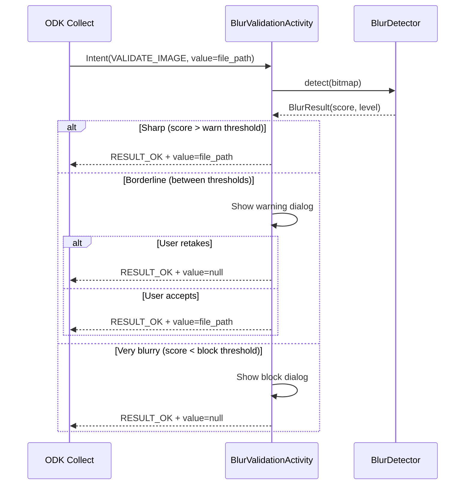

# Image Blur Detection

ExternalODK includes an external app intent that checks image quality (blur) before accepting photos into ODK Collect forms. This is useful for ensuring photos of farmer names, documents, or ID cards are readable.

## How It Works

## Two-Tier Response

The app uses two thresholds for a tiered approach:

| Blur Score | Classification | App Behavior |
|------------|---------------|--------------|
| < 50 (block threshold) | Very blurry / unreadable | **Blocked** — must retake photo |
| 50–100 (between thresholds) | Borderline quality | **Warning** — retake or accept |
| > 100 (warn threshold) | Sharp / readable | **Pass** — silently accepted |

Both thresholds are adjustable at runtime via **Settings** in the app (no APK rebuild needed).

## XLSForm Configuration

Add a text question with the external app appearance to trigger blur validation after a photo is captured.

**survey sheet:**

| type | name | label | appearance | required |
|------|------|-------|------------|----------|
| image | farmer_photo | Take photo of farmer name | | yes |
| text | validate_photo | Validate Photo | ex:org.akvo.afribamodkvalidator.VALIDATE_IMAGE(value=${farmer_photo}) | yes |

> **Important**: The `appearance` column must contain the exact package name `ex:org.akvo.afribamodkvalidator.VALIDATE_IMAGE(...)`. A typo or missing package name means ODK Collect will not launch the validation app.

### How Blocking Works

The blocking mechanism mirrors polygon validation — it uses the return value, not XLSForm constraints:

1. **No image path received** or **invalid path**: Returns `RESULT_CANCELED`. ODK Collect does NOT update the field.

2. **Very blurry (blocked)**: Shows error dialog, then returns `RESULT_OK` with `value = null`. This clears the field in ODK Collect, preventing submission when `required=yes`.

3. **Borderline (warning)**: Shows warning with two choices:
   - "Retake Photo" — returns `value = null` (clears field)
   - "Use Anyway" — returns `value = file_path` (accepts image)

4. **Sharp (pass)**: Returns `RESULT_OK` with the original file path as `value`. ODK Collect accepts the value silently.

## Intent Extras

| Extra | Description | Required |
|-------|-------------|----------|
| `value` | Image file path from ODK Collect (e.g., `/storage/emulated/0/odk/instances/.../photo.jpg`) | Yes |

## Algorithm

The blur detection uses **Laplacian variance** — a well-established method that measures edge sharpness without requiring OpenCV (keeping the APK small):

1. **Downscale** image to max 500px (preserving aspect ratio) for consistent performance
2. **Convert to grayscale** using luminance formula: `0.299R + 0.587G + 0.114B`
3. **Apply 3×3 Laplacian kernel** convolution: `[[0,1,0],[1,-4,1],[0,1,0]]`
4. **Compute variance** of the Laplacian output
5. **Classify** the score against the two thresholds

Higher variance = more edges = sharper image. A uniform (blurry) image has near-zero variance.

## Settings

Thresholds are configurable at runtime via the **Settings** screen (Home → MoreVert menu → Settings):

| Setting | Default | Range | Description |
|---------|---------|-------|-------------|
| Warn Threshold | 100 | 20–500 | Warn if blur score is below this value |
| Block Threshold | 50 | 10–200 | Always block if blur score is below this value |

The block threshold is always enforced to be less than the warn threshold.

### Tuning Process

1. Deploy with defaults (warn=100, block=50)
2. Collect sample field photos (both good and blurry)
3. Check blur scores in logcat: `adb logcat -s BlurValidationActivity`
4. Adjust thresholds in Settings based on results:
   - Too many false warnings → lower warn threshold
   - Blurry images getting through → raise warn threshold
   - Readable images getting blocked → lower block threshold
   - Unreadable images only warned → raise block threshold

## Installation

1. Build and install the APK on the same device as ODK Collect
2. Configure your XLSForm with the external app appearance (see above)
3. Deploy the form to your device
4. Optionally adjust thresholds via Settings before field deployment

## Security

- **Path validation**: The activity only accepts file paths within external storage directories. Paths outside allowed directories are rejected.
- **Offline**: All processing happens on-device. No images are transmitted anywhere.
