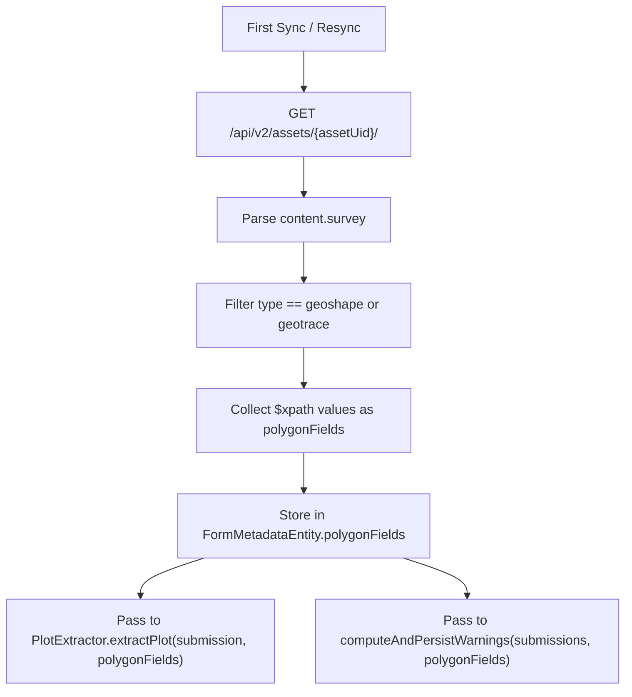

# Dynamic Polygon Field Discovery — Implementation Plan

**Problem**: Polygon field names vary across KoboToolbox forms (e.g., `boundary_mapping/manual_boundary`, `validate_polygon`, `consent_group/consented/boundary_mapping/Open_Area_GeoMapping`). The current static `plot_extraction_config.json` breaks whenever a new form uses a different field name. Similarly, `plotNameFields` are form-specific.

**Solution**: Fetch form structure from Kobo API (`GET /api/v2/assets/{assetUid}/`) at sync time and discover `geoshape`/`geotrace` fields dynamically. Replace `plotNameFields` with a simple fallback: `instanceName` → `_id`.

**Reference**: [african-bamboo-dashboard backend](https://github.com/akvo/african-bamboo-dashboard/blob/main/backend/utils/kobo_client.py#L76-L85) uses the same approach.

## Kobo Asset Detail API

```
GET /api/v2/assets/{assetUid}/?format=json
Authorization: Basic <credentials>
```

Response (relevant parts):

```json
{
  "content": {
    "survey": [
      {
        "type": "geoshape",
        "name": "manual_boundary",
        "$xpath": "boundary_mapping/manual_boundary",
        "label": ["Draw boundary"]
      },
      {
        "type": "text",
        "name": "First_Name",
        "$xpath": "consent_group/consented/First_Name",
        "label": ["First Name"]
      }
    ]
  }
}
```

## Architecture



## What Changes

| Component | Before | After |
|---|---|---|
| `plot_extraction_config.json` | 4 fields (polygon, name, region, subRegion) | **Delete entirely** |
| `PlotExtractionConfig.kt` | Data class with 4 fields | **Delete** |
| `PlotExtractor.extractPlot()` | Reads polygon fields from static config | Accepts `polygonFields: List<String>` parameter |
| `PlotExtractor.buildPlotName()` | Maps `plotNameFields` from config, falls back to `"Unknown"` | `submission.instanceName ?: submission._id` |
| `KoboRepository.extractPolygonDataForWarnings()` | Hardcoded field list (duplicate!) | **Delete** — uses same `polygonFields` param |
| `KoboApiService` | No asset detail endpoint | Add `getAssetDetail()` |
| `FormMetadataEntity` | `assetUid` + `lastSyncTimestamp` | Add `polygonFields: String?` |
| `AppDatabase` | Version 6 | Version 7 with migration |

## Data Model Change

```kotlin
data class FormMetadataEntity(
    val assetUid: String,       // PK
    val lastSyncTimestamp: Long,
    val polygonFields: String? = null  // JSON array: ["boundary_mapping/manual_boundary", ...]
)
```

Room migration v6 → v7: `ALTER TABLE form_metadata ADD COLUMN polygonFields TEXT`

## Implementation Steps

### Step 1: Add Asset Detail API Endpoint

```kotlin
// KoboApiService.kt
@GET("api/v2/assets/{assetUid}/")
suspend fun getAssetDetail(
    @Path("assetUid") assetUid: String,
    @Query("format") format: String = "json"
): JsonObject
```

### Step 2: Update FormMetadataEntity + Migration

Add `polygonFields: String? = null`. Room migration v6 → v7.

Add DAO methods:
```kotlin
@Query("UPDATE form_metadata SET polygonFields = :fields WHERE assetUid = :uid")
suspend fun updatePolygonFields(uid: String, fields: String)

@Query("SELECT polygonFields FROM form_metadata WHERE assetUid = :uid")
suspend fun getPolygonFields(uid: String): String?
```

### Step 3: Extract Geo Fields from Asset Detail

```kotlin
private fun extractPolygonFieldPaths(assetDetail: JsonObject): List<String> {
    val content = assetDetail["content"] as? JsonObject ?: return emptyList()
    val survey = content["survey"] as? JsonArray ?: return emptyList()

    return survey.filterIsInstance<JsonObject>()
        .filter { item ->
            val type = item["type"]?.jsonPrimitive?.contentOrNull ?: ""
            type == "geoshape" || type == "geotrace"
        }
        .mapNotNull { item ->
            item["\$xpath"]?.jsonPrimitive?.contentOrNull
                ?: item["name"]?.jsonPrimitive?.contentOrNull
        }
}
```

### Step 4: Fetch + Store on Sync

```kotlin
private suspend fun fetchAndStorePolygonFields(assetUid: String): List<String> {
    return try {
        val assetDetail = apiService.getAssetDetail(assetUid)
        val fields = extractPolygonFieldPaths(assetDetail)
        if (fields.isNotEmpty()) {
            formMetadataDao.updatePolygonFields(assetUid, Json.encodeToString(fields))
        }
        fields
    } catch (e: Exception) {
        Log.e(TAG, "Failed to fetch asset detail, using stored fields", e)
        val stored = formMetadataDao.getPolygonFields(assetUid)
        if (stored != null) Json.decodeFromString(stored) else emptyList()
    }
}
```

Called in `fetchSubmissionsInternal()` and `resync()` before processing submissions.

### Step 5: Refactor PlotExtractor

```kotlin
fun extractPlot(submission: SubmissionEntity, polygonFields: List<String>): PlotEntity?
```

Replace `buildPlotName()`:

```kotlin
// Before: config.plotNameFields → mapNotNull → joinToString → ifBlank { "Unknown" }
// After:
val plotName = submission.instanceName ?: submission._id
```

Remove `regionField`/`subRegionField` config dependency — keep them hardcoded in `PlotExtractor` (they're stable: `"woreda"` and `"kebele"`).

### Step 6: Remove Duplicates

- Delete `extractPolygonDataForWarnings()` from `KoboRepository`
- Pass `polygonFields` to `computeAndPersistWarnings(submissions, polygonFields)`
- Extract polygon data inline using the same field list

### Step 7: Delete Static Config

- Delete `app/src/main/assets/plot_extraction_config.json`
- Delete `PlotExtractionConfig.kt`
- Remove `loadConfig()` and `DEFAULT_CONFIG` from `PlotExtractor`

### Step 8: Update Tests

- `PlotExtractorTest` — pass `polygonFields` as parameter
- `KoboRepositorySyncTest` — mock `getAssetDetail()` response
- New: `extractPolygonFieldPaths()` unit tests

## Tech AC Checklist

### API
- [ ] `KoboApiService.getAssetDetail()` — GET `/api/v2/assets/{assetUid}/`

### Field Discovery
- [ ] `extractPolygonFieldPaths()` filters by `type == "geoshape"` or `type == "geotrace"`
- [ ] Uses `$xpath` with fallback to `name`
- [ ] Returns empty list if no geo fields found
- [ ] Handles nested groups (`$xpath` includes full path)

### Persistence
- [ ] `FormMetadataEntity` gains `polygonFields: String?` column
- [ ] Room migration v6 → v7 (ALTER TABLE ADD COLUMN)
- [ ] `FormMetadataDao.updatePolygonFields(uid, fields)`
- [ ] `FormMetadataDao.getPolygonFields(uid): String?`

### Integration
- [ ] Asset detail fetched on first sync + refreshed on resync
- [ ] `PlotExtractor.extractPlot(submission, polygonFields)` accepts parameter
- [ ] `computeAndPersistWarnings(submissions, polygonFields)` accepts parameter
- [ ] `extractPolygonDataForWarnings()` removed
- [ ] Plot name uses `instanceName ?: _id` (no config needed)

### Cleanup
- [ ] Delete `plot_extraction_config.json`
- [ ] Delete `PlotExtractionConfig.kt`
- [ ] Remove `loadConfig()` and `DEFAULT_CONFIG` from `PlotExtractor`
- [ ] Remove `Context` injection from `PlotExtractor` (no longer reads assets)

### Tests
- [ ] Unit: `extractPolygonFieldPaths()` — geoshape fields from survey JSON
- [ ] Unit: `extractPolygonFieldPaths()` — geotrace fields
- [ ] Unit: `extractPolygonFieldPaths()` — empty list when no geo fields
- [ ] Unit: `extractPolygonFieldPaths()` — prefers `$xpath` over `name`
- [ ] Unit: PlotExtractor with dynamic polygon fields
- [ ] Unit: Plot name falls back to `instanceName` then `_id`
- [ ] Unit: Fallback to stored fields on API failure

## Risks & Mitigations

| Risk | Mitigation |
|---|---|
| Asset detail API adds latency | Single request per sync, cached in DB |
| Form has no geoshape/geotrace fields | Empty list → no plots extracted, logged |
| `$xpath` missing from survey item | Fallback to `name` |
| Network failure on asset detail | Fall back to previously stored polygon fields |
| Form structure changes | Re-fetched on every resync |
