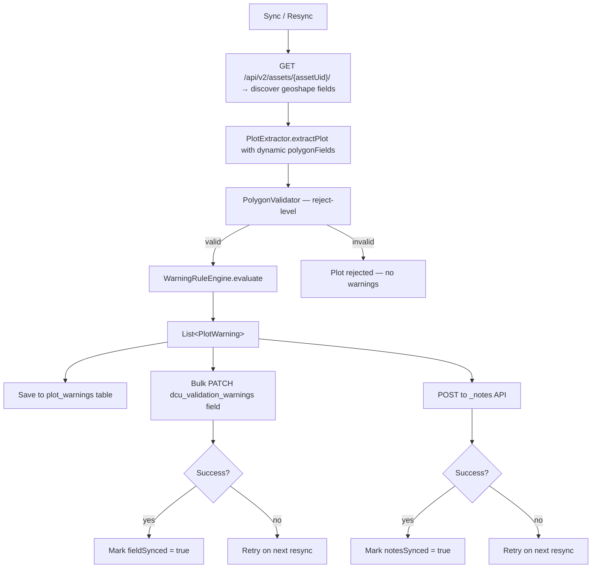
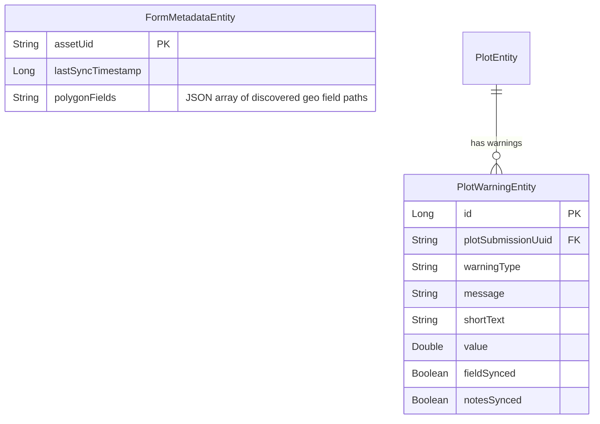

# Extended Validation Rules (Warning Flags) — Implementation Plan

**Source**: [akvo-odk-extended-validation-user-ac.md](akvo-odk-extended-validation-user-ac.md)
**Branch**: `feature/25-extended-validation-rules-warnings`

## Overview

Add 5 warning-only validation checks that flag plots for review without rejecting them. Warnings are:
1. Stored locally in a `plot_warnings` table for app display
2. Written back to Kobo via two redundant strategies:
   - **Primary**: Bulk PATCH a dedicated XLSForm field (`dcu_validation_warnings`) via `/api/v2/assets/{assetUid}/data/bulk/`
   - **Fallback**: POST to `_notes` on the submission (v1 API, available until June 2026)

Polygon fields are discovered dynamically from the Kobo asset detail API — no static config needed. See [dynamic-polygon-field-discovery-plan.md](dynamic-polygon-field-discovery-plan.md) for details.

## Warning Rules

| # | Rule | Threshold | Input |
|---|---|---|---|
| W1 | Average GPS accuracy too low | > 15 m | `GeoCoordinate.acc` from parsed geoshape |
| W2 | Gap between consecutive points | > 50 m | Haversine distance between adjacent coordinates |
| W3 | Uneven point spacing | CV > 0.5 | Coefficient of Variation of inter-point distances |
| W4 | Plot area too large | > 20 ha | Shoelace formula with latitude correction |
| W5 | Too few vertices (rough boundary) | 6–10 vertices (excl. closing) | Vertex count from parsed geoshape |

## Architecture



## Kobo Write-Back Strategy

### Primary: Bulk PATCH XLSForm Field (`dcu_validation_warnings`)

XLSForm requires a `calculate` field with `once('')`:

| type | name | calculation |
|---|---|---|
| calculate | dcu_validation_warnings | `once('')` |

The app writes warnings via the bulk data API:

```
PATCH /api/v2/assets/{assetUid}/data/bulk/
Authorization: Basic <credentials>
Content-Type: application/json

{
  "payload": {
    "submission_ids": [757910942],
    "data": {
      "dcu_validation_warnings": "GPS_ACCURACY_LOW: 18.3m (>15m) | AREA_TOO_LARGE: 25.1ha (>20ha)"
    }
  }
}
```

Submissions with the same warning text are batched into a single bulk call.

### Fallback: `_notes` API

```
POST /api/v1/notes
Authorization: Basic <credentials>
Content-Type: application/x-www-form-urlencoded

note=[DCU Warning] Average GPS accuracy is 18.3m (threshold: 15m)&instance={_id}
```

v1 API deprecated, scheduled removal June 2026.

### Warning Text Format

**For `dcu_validation_warnings` field** (compact, pipe-delimited):
```
GPS_ACCURACY_LOW: 18.3m (>15m) | POINT_GAP_LARGE: 62.4m seg 3-4 (>50m) | AREA_TOO_LARGE: 44.7ha (>20ha)
```

**For `_notes`** (human-readable, one note per warning):
```
[DCU Warning] Average GPS accuracy is 18.3m (threshold: 15m)
[DCU Warning] Gap of 62.4m between points 3-4 (threshold: 50m)
[DCU Warning] Plot area is 44.7ha (threshold: 20ha)
```

## Data Model



## Components

```
validation/
├── PlotWarning.kt              # WarningType enum + PlotWarning data class
├── WarningRuleEngine.kt        # All 5 rules + calculateAreaHectares()
├── GeoMath.kt                  # Haversine distance, CV calculation

data/
├── entity/PlotWarningEntity.kt # Room entity with sync tracking
├── entity/FormMetadataEntity.kt # + polygonFields column
├── dao/PlotWarningDao.kt       # CRUD + aggregation + sync status
├── dao/FormMetadataDao.kt      # + updatePolygonFields / getPolygonFields
├── database/AppDatabase.kt     # v7, MIGRATION_5_6 + MIGRATION_6_7
├── repository/PlotExtractor.kt # extractPlot(submission, polygonFields)
├── repository/KoboRepository.kt # Warning compute + Kobo sync + field discovery
├── network/KoboApiService.kt   # + getAssetDetail + patchSubmissionsBulk + addNote
```

## Implementation Phases (All Complete)

### Phase 1: Core Validation Engine ✅

- `GeoMath.kt` — `haversineDistance()`, `coefficientOfVariation()`
- `PlotWarning.kt` — `WarningType` enum (5 types) + `PlotWarning` data class
- `WarningRuleEngine.kt` — All 5 rules + `calculateAreaHectares()` using Shoelace formula

### Phase 2: Persistence (Room) ✅

- `PlotWarningEntity` with `fieldSynced`/`notesSynced` sync tracking
- `PlotWarningDao` — batch insert, aggregation, sync status, `getAllPlotUuidsWithWarnings()`
- Room migration v5 → v6 (plot_warnings table) + v6 → v7 (polygonFields column)
- Warning computation runs for ALL submissions without warnings (not just newly extracted plots)

### Phase 3: Push to Kobo ✅

- `KoboApiService.patchSubmissionsBulk()` — `PATCH /api/v2/assets/{assetUid}/data/bulk/`
- `KoboApiService.addNote()` — `POST /api/v1/notes`
- `syncWarningsToKobo()` → `syncWarningsViaField()` (bulk, grouped by warning text) + `syncWarningsViaNotes()` (per warning)
- Fire-and-forget; failures logged, retried on next sync

### Phase 4: UI ✅

- `SubmissionUiModel.warningCount` — badge display
- `SubmissionListItem` — amber warning badge with count
- `SubmissionDetailScreen` — WarningsSection with amber cards
- `HomeDashboardScreen` — warning filter toggle icon (amber when active)
- `HomeViewModel` — `showOnlyWarnings` filter + `applyFilters()`

### Phase 5: Dynamic Polygon Field Discovery ✅

- `KoboApiService.getAssetDetail()` — `GET /api/v2/assets/{assetUid}/`
- `extractPolygonFieldPaths()` — filters `content.survey` for `geoshape`/`geotrace`, uses `$xpath` with `name` fallback
- `FormMetadataEntity.polygonFields` — caches discovered fields as JSON array
- `PlotExtractor.extractPlot(submission, polygonFields)` — accepts fields as parameter
- Plot name: `instanceName ?: _id` (no config needed)
- Region/subRegion: hardcoded `"woreda"` / `"kebele"` (stable across forms)
- Deleted: `plot_extraction_config.json`, `PlotExtractionConfig.kt`

### Phase 6: XLSForm & Documentation ✅

- `dcu_validation_warnings` calculate field with `once('')` deployed to Kobo
- `README.md` updated with field documentation

## Tech AC Checklist

### Validation Engine ✅
- [x] `GeoMath.haversineDistance()` returns distance in meters
- [x] `GeoMath.coefficientOfVariation()` returns CV
- [x] W1: Warning when average acc > 15m (skip 0.0 values)
- [x] W2: Warning when any consecutive gap > 50m, message includes segments
- [x] W3: Warning when CV > 0.5, handles < 3 points
- [x] W4: Warning when area > 20 ha
- [x] W5: Warning when vertex count (excl. closing) is 6–10
- [x] `WarningRuleEngine.evaluate()` returns combined list; multiple per plot OK

### Persistence ✅
- [x] `PlotWarningEntity` with sync tracking (`fieldSynced`, `notesSynced`)
- [x] Room migrations v5→v6 (plot_warnings) and v6→v7 (polygonFields column)
- [x] `PlotWarningDao` — full CRUD, aggregation, sync status, `getAllPlotUuidsWithWarnings()`
- [x] Warnings computed for ALL submissions without warnings (not just new plots)
- [x] On resync: always re-checks for submissions missing warnings

### Dynamic Field Discovery ✅
- [x] `KoboApiService.getAssetDetail()` fetches form structure
- [x] `extractPolygonFieldPaths()` filters `geoshape`/`geotrace` from `content.survey`
- [x] Uses `$xpath` with fallback to `name`
- [x] Cached in `FormMetadataEntity.polygonFields`; re-fetched on each sync
- [x] Fallback to stored fields on API failure
- [x] `PlotExtractor` accepts `polygonFields` parameter (no static config)
- [x] Plot name: `instanceName ?: _id`

### Kobo Sync — Primary (Bulk PATCH) ✅
- [x] `dcu_validation_warnings` calculate field added to XLSForm with `once('')`
- [x] `KoboApiService.patchSubmissionsBulk()` — `PATCH /api/v2/assets/{assetUid}/data/bulk/`
- [x] Payload: `{payload: {submission_ids: [...], data: {dcu_validation_warnings: "..."}}}`
- [x] Submissions with same warning text batched into single call
- [x] Non-numeric `_id` values safely skipped
- [x] `fieldSynced = true` on success; failures retried on next sync

### Kobo Sync — Fallback (_notes) ✅
- [x] `KoboApiService.addNote()` — `POST /api/v1/notes`
- [x] Note format: `[DCU Warning] <human-readable message>`
- [x] Each warning posted as separate note
- [x] `notesSynced = true` on success; failures retried on next sync

### UI ✅
- [x] `SubmissionListItem` — amber warning badge with count
- [x] `SubmissionDetailScreen` — warning section with human-readable messages
- [x] Warning section visually distinct (amber/orange)
- [x] Home dashboard warning filter toggle (amber icon when active)

### Documentation ✅
- [x] `README.md` updated with `dcu_validation_warnings` field + explanation
- [x] Dynamic field discovery plan documented

### Integration & Safety ✅
- [x] Warnings computed only for valid plots (after `PolygonValidator` passes)
- [x] Warning computation doesn't block sync
- [x] Kobo sync failures don't block local warning storage
- [x] Existing overlap detection and polygon validation unaffected
- [x] Plots are NEVER rejected due to warnings

### Tests ✅
- [x] Unit: `GeoMath` — haversine, CV edge cases (14 tests)
- [x] Unit: `WarningRuleEngine` — all 5 rules, boundary values (24 tests)
- [x] Unit: `PolygonFieldDiscoveryTest` — geoshape/geotrace discovery, xpath vs name, nested groups (10 tests)
- [x] Unit: `PlotExtractorTest` — dynamic fields, plot name fallback, empty fields (19 tests)
- [x] Unit: Sync-to-Kobo — bulk PATCH, notes, failure handling, grouping (6 tests)

## Risks & Mitigations

| Risk | Mitigation |
|---|---|
| GPS accuracy = 0.0 when unavailable | W1 skips 0.0 values; no warning if all unavailable |
| Kobo v1 notes API deprecated June 2026 | Primary strategy uses v2 bulk PATCH; notes are fallback only |
| Polygon field names vary across forms | Dynamic discovery from asset detail API; cached in DB |
| Asset detail API failure | Fallback to previously stored polygon fields |
| Form structure changes after deployment | Re-fetched on every sync/resync |
| Non-numeric `_id` in submission | `toIntOrNull()` safely skips; warning still stored locally |
| Submissions synced before warning feature | `getAllPlotUuidsWithWarnings()` catches and processes them on next sync |

## Out of Scope

- Rejecting/blocking plots based on warnings
- Configurable thresholds (hardcoded per African Bamboo agreement, Jan 2026)
- REST Services webhook integration
- Warning export/reporting beyond Kobo field + notes
- Dynamic discovery of `plotNameFields` / `regionField` / `subRegionField`
